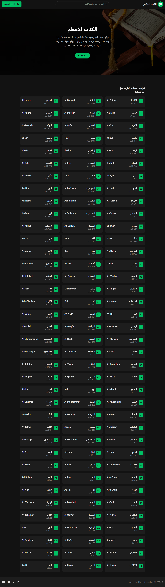

<h1 align="right">الكتاب الاعظم</h1>

    موقع القرآن الكريم هو منصة شاملة تهدف إلى توفير تجربة قراءة واستماع مريحة للقرآن الكريم عبر الإنترنت. يوفر الموقع مجموعة متنوعة من الأدوات والخدمات للمستخدمين، تشمل:

    عرض النصوص القرآنية: قراءة نصوص القرآن الكريم باللغة العربية مع الترجمة إلى اللغة الإنجليزية، مما يسهل فهم معاني الآيات.
    التلاوة الصوتية: الاستماع إلى تلاوات مختلفة للقرآن الكريم من خلال ملفات صوتية عالية الجودة، مما يعزز تجربة التعلم والتدبر.
    تصفح السور والآيات: تنقل سهل بين السور والآيات، مع إمكانية الاستماع إلى كل آية على حدة.
    الوضع النهاري والليلي: تصميم الموقع يدعم وضعين للعرض، النهاري والليلي، لتلبية احتياجات المستخدمين في مختلف أوقات اليوم وتوفير تجربة قراءة مريحة.
    يوفر الموقع واجهة بسيطة وسهلة الاستخدام، ويهدف إلى تيسير الوصول إلى القرآن الكريم لجميع المسلمين حول العالم، سواء كانوا يرغبون في قراءة النصوص، فهم الترجمة، أو الاستماع إلى التلاوات.

<h1 align="right">مهارات:</h1>

  
  
  
  
  
  

<h2>لقطات العرض التجريبي</h2>
